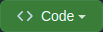

  <h1>Pixels Art</h1>
  
A board to making beautiful drawings using pixels

  
  
  

  [Project Web Page](https://fabio-vicente.github.io/Pixels-Art/)

  

    

      <strong>See a screenshot</strong>
    

     
    
  

  

 

## About

Get a full-featured board to make your best draws using pixels arts.

Choose colors, and save your best ones. Resize your board and save it to continue to drawing later. All of it accessible both for PC as for mobile. What you waiting for start to drawing?

### Development Skills

- HTML;
- CSS;
- Javascript;
- DOM;
- Events;
- Storage;
- Mobile first;
- Problem solving.

 

## Getting Started

### Prerequisites

  - Web Browser compatible with HTML5, CSS3 and EcmaScript 6.

### Instalation

  Use one of these three ways to install the project locally.

#### 1. Download ZIP:
>
>  - Click on the `Code` green button at repository top;
>
>      
>
>  - Click on `Download ZIP` button;
>
>      
>  
>  - Unzip the downloaded file in a choosen directory;

#### 2. Clone repository via HTTPS:
>
>  - Use `https://github.com/Fabio-Vicente/Pixels-Art.git` endpoint for clonning via HTTPS (credencials may be needed);

#### 3. Clone repository via SSH:
>
>  - Use `git@github.com:Fabio-Vicente/Pixels-Art.git` endpoint for clonning via SSH (it must be need set a SSH Key);

 

## Usage

Once you have procedure on the [installation process](#instalation), open the [index.html](index.html) downloaded file on your browser to start to use the program.

**Don't wanna install the project locally?** No worries! You can acess the web project by this link:

> https://fabio-vicente.github.io/Pixels-Art/

 

## Lint

The project was staticly tested using [StyleLint](https://stylelint.io/) and [ESLint](https://eslint.org/), whose appoints no error on code analyses. These tools enforces code readbility and standart development style such on CSS development (StyleLint) as on Javascript development (ESLint).

## Features

### Select your color

You have a huge range of colors (16777216 to be exact) to choose and make your board even more beautiful.

Initially, you'll see four colors available. The black one, and other three random colors.

Every time you refresh the page, you have new colors available! 🎉 All colors will change, with except to black, which is the default color, to make available try new and undiscovered tonalities.

 

  

 

#### Ok. But if I've found a color that I like, and I don't want to lose it with the refresh?

No problems here too. It's possible to save a specific showed color by double-clicking it, and it will be safe from future refreshs.

Even if you close your section, finish your browser or turn off your computer, your favorite colors will be safe when you back again for Pixels Art.

To unfavorite a color, and make room for new ones, you can use the same way. Double-click on the color, and it will be unfavorited.

 

  

 

### Resize your board

Your board will start with a default size of 5x5. But if I want to increase that, it's possible? Of course!

Select the board length on the input available, lesser or equal than 50, and greater or equal than 5, and click on `VQV` button (it can be fired by `Enter` key too). You'll see the board size change.

 

  

 

> ⚠️ BEWARE! If you already have any drawing on your board, it will be lost on resizing.

### Save your work

It's so upset when we have done a great work, but we get it lost because we need close our browser or even turn off the computer. But no with Pixels Art.

It's possible to save your work for continue to drawing whenever you want. After you have finished by now, it's just click on `Salvar` button, and your job will be saved on local storage, waiting for you for the next time.

After all, if you want to clear your board, and start a new drawning from beginning, you can click `Limpar` button, and you can start all over again. Awesome!

 

  

 

 

## Authors & contributors

The development of this project, as well all documentation, was made by [Fábio Vicente(Me)](https://github.com/Fabio-Vicente).

 

## Acknowledgements

- [Trybe](https://www.betrybe.com/) by porpose this project and specify requirements;
- [Amazing Github Template](https://github.com/dec0dOS/amazing-github-template) which provides a Readme Template for inspiration.

 
 
 
 

